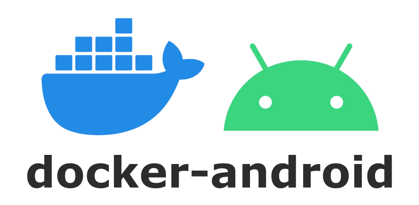

# Docker build Android




Docker 文档  <https://docs.docker.com/>

[Android sdk tools](https://dl.google.com/android/repository/sdk-tools-linux-3859397.zip)

## Oveview

------

此工具使用docker对android项目进行构建，利用dockrfile构建自己项目所需要的运行环境镜像

```dockerfile
docker build -t docker_android .  --no-cache
```

